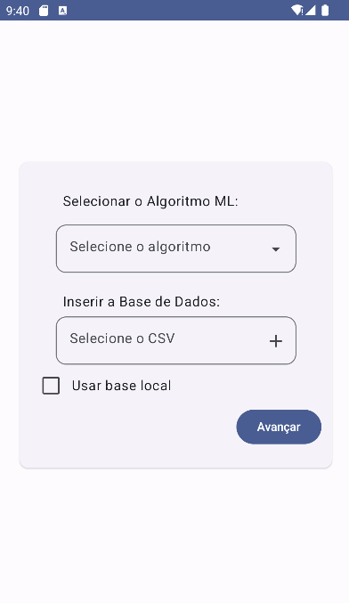
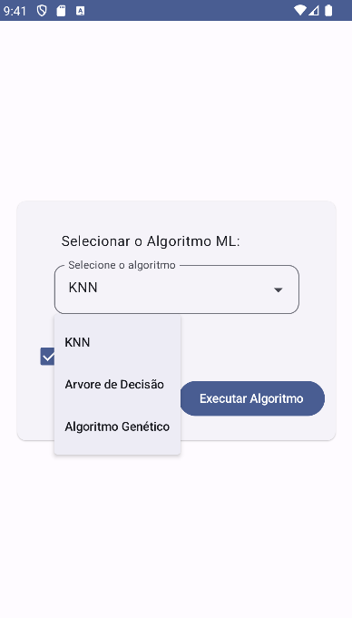
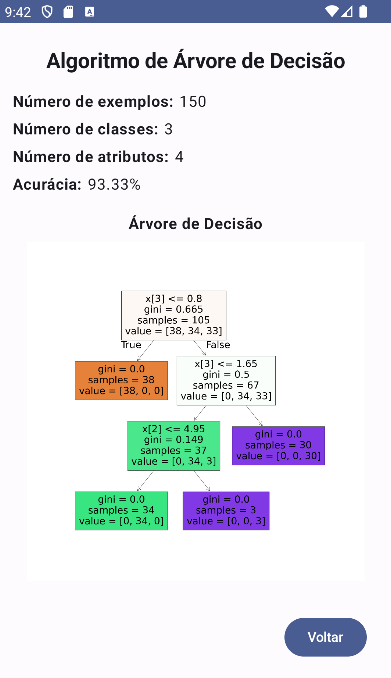

# Machine Learning App

###### Repositório: [LCN/Machine Learning App](https://github.com/aasjunior/ldm_algoritmo_genetico.git)

<p align="justify">
O Machine Learning App é um aplicativo desenvolvido com Kotlin, Android Studio e Jetpack Compose, para aplicação de algoritmos de aprendizado de máquina e exibição dos resultados.
</p>

<div align="center">
  
  
  
  
  
</div>
<br>

## Pré-Requisitos

* JDK (Java Development Kit)
* Git
* Android Studio
* VSCode
<br>

<div align="center">
   
   
   
</div>

## Dependências

Este projeto depende da seguinte APIs:

* [mlapp-api](https://github.com/aasjunior/mlapp-api.git)

## Configuração do Projeto

1. Clone o repositório para sua máquina local usando o seguinte comando
```
git clone https://github.com/aasjunior/MachineLearningApp.git
```

2. Abra o projeto pelo Android Studio

3. Certifique-se de que o JDK está instalado e configurado corretamente

4. Certifique-se de que o Python está instalado e funcionando corretamente

5. Configure a API mlapp-api pelo VS Code ou IDE de sua preferência. A API estará rodando em `http://127.0.0.1:8000`

6. Execute o Emulador do Android Studio
<br>

## Problemas Conhecidos

### Erro de Caracteres Não-ASCII 

Se você encontrar um erro relacionado a caracteres não-ASCII durante a execução ou compilação do projeto, existem duas soluções possíveis:

1. **Mover o projeto para um diretório diferente**: Certifique-se de que o novo diretório não contém caracteres não-ASCII no caminho.

2. **Adicionar uma linha ao arquivo gradle.properties**: Você pode adicionar a linha 'android.overridePathCheck=true' ao arquivo gradle.properties no diretório do projeto. Isso desativará a verificação do caminho do projeto.
<br>

## UI
A interface do usuário deste aplicativo foi construída usando **Jetpack Compose** e **Material 3**.

O Jetpack Compose é uma moderna toolkit de UI para Android que simplifica e acelera o desenvolvimento da interface do usuário. Ele permite a criação de interfaces de usuário concisas e idiomáticas com menos código e ferramentas poderosas para visualização de layout.

<div>O Material 3 é a mais recente versão do Material Design, que introduz novos componentes, estilos e recursos para ajudar a criar experiências de usuário mais expressivas e dinâmicas.
<br> </div><br>

#### Tecnologias

<br>

<div align="center">
   
   
   
   
   
   
</div>


##
###### Aviso
Este é um trabalho acadêmico realizado como tarefa da disciplina de Laboratório Mobile/Computação Natural no 5º Semestre de Desenvolvimento de Software Multiplataforma
